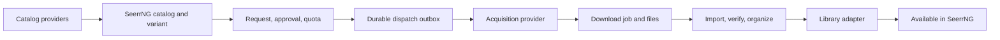

# Software acquisition, catalog, and request plan

**Status:** Research and implementation proposal

**Researched:** 2026-09-25

**Confidence:** High that usable third-party acquisition managers exist for ROMs and games; moderate that their current API coverage and supported platform sets match SeerrNG's needs. No single cross-platform manager for general desktop apps surfaced in the reviewed sources.

## Goal and scope

Add request-driven acquisition for:

- Retro emulation software and ROMs.
- Modern emulation software and console titles.
- Windows, Linux, and macOS games.
- Windows, Linux, and macOS applications.

The work covers catalog discovery, request and approval, acquisition dispatch, download progress, import or file organization, and availability in a library. It does not cover playback, launching, emulator setup, or compatibility runtime setup.

## Research conclusion

There are third-party *arr-style acquisition managers for ROMs and games, so SeerrNG should evaluate and integrate them before building another downloader. ROMarr is the strongest first pilot for ROM acquisition because its documented API covers request submission, release search, queue, history, and webhooks. Questarr and Gamarr are candidates for the broader game scope, but their request and status APIs need compatibility testing.

The app category has no single acquisition manager spanning Windows, macOS, and Linux. The reviewed tools are OS or store specific: WinGet, Homebrew, Flatpak, and itch.io's butlerd. SeerrNG should own the shared catalog and request workflow, then delegate acquisition to a configured provider or a small target-host adapter for each platform.

This argues against building a general indexer, downloader, or package mirror. Build the SeerrNG domain and provider adapters; build an acquisition backend only for a capability that the evaluated providers do not supply.

## Third-party candidates

| Area | Candidate | Relevant capabilities | Assessment and next step |
| --- | --- | --- | --- |
| Retro and console ROMs | [ROMarr](https://github.com/BlizzHacker/romarr) | Searches through Prowlarr or configured indexers, dispatches to download clients, imports and validates files, and can target RomM, Gaseous, Retrom, Gameyfin, or a platform-organized folder. It documents request, release search, queue, history, webhook, and health endpoints. | Best first pilot. Its latest reviewed release was v0.9.0 and the project is early-stage, so pin a tested release and validate restart recovery, idempotency, auth, queue correlation, and import behavior before relying on it. [API and workflow](https://github.com/BlizzHacker/romarr#api) · [releases](https://github.com/BlizzHacker/romarr/releases) |
| Modern emulation | ROMarr; [Gamarr](https://github.com/JeremiahM37/gamarr) | ROMarr lists 58 supported systems, including newer console generations, and handles multi-file disc sets. Gamarr lists PC and console targets including PS2, PS3, PS4, Wii U, 3DS, and Switch, with request states, progress, retries, and library organization. | Do not define “modern” by an implementation guess. First agree the console/platform matrix, then verify the exact systems, formats, and metadata IDs against each provider. ROMarr is still the leading candidate where its matrix fits. [ROMarr platform matrix](https://github.com/BlizzHacker/romarr#supported-platforms) · [Gamarr platform and download features](https://github.com/JeremiahM37/gamarr#supported-platforms) |
| Games | [Questarr](https://github.com/Doezer/Questarr) | Game discovery and backlog, Prowlarr/Torznab and Newznab, several download clients, post-processing, and an API-key-authenticated integration contract for requesting a title and syncing library entries. The integration contract is versioned. | Include in the first game compatibility spike. Its integration endpoints support request submission and library sync; the reviewed contract does not expose a request-specific download queue/progress readback, so test whether SeerrNG can reliably display and reconcile lifecycle status. Questarr is GPL-3.0; review deployment and integration terms before adoption. [Integration API source](https://github.com/Doezer/Questarr/blob/main/server/routes/integration.ts) · [releases](https://github.com/Doezer/Questarr/releases) |
| Games and ROMs | Gamarr | Self-hosted search/download manager with Prowlarr, torrent and Usenet clients, a 24-platform game/ROM matrix, library management, and a request workflow. It documents API-key authentication, download progress, retry, and webhook notifications. | Compare against Questarr for coverage and status reconciliation. Verify the precise public endpoint contract, auth behavior on every integration route, and maintenance cadence before choosing it as a backend. [Project and API configuration](https://github.com/JeremiahM37/gamarr) · [releases](https://github.com/JeremiahM37/gamarr/releases) |
| Store-specific games and tools | [itch.io butlerd](https://itch.io/docs/butler/launcher-integration.html) | Official JSON-RPC daemon for browsing an authenticated itch.io library and queuing downloads, planning space, performing tasks with progress, and cancelling. It can also run an install into an explicit folder without registering a launcher library entry. | A possible store-specific adapter, not a universal game/app manager. It expects a daemon, an account, and install locations on the host doing the acquisition. Integrate only the download/task surface; leave launch operations out of scope. |
| General apps | [WinGet](https://learn.microsoft.com/en-us/windows/package-manager/winget/download), [Homebrew](https://docs.brew.sh/Manpage#fetch-options-formulacask-), [Flatpak](https://docs.flatpak.org/en/latest/using-flatpak.html) | WinGet can search and download versioned installers and dependencies; Homebrew can fetch formula bottles or cask binaries and report SHA-256; Flatpak discovers and installs apps from configured remotes and supports single-file bundles. | These are package managers, not shared SeerrNG request services. WinGet and Homebrew expose download operations; Flatpak is primarily a remote install/update flow, and its single-file bundles are not a generic download endpoint. Use a platform-aware adapter where the package format and credentials are available. Start with a narrow platform/source combination rather than promising a universal app catalog. |

Library products such as RomM, GameVault, and Gameyfin primarily organize or deliver files already present. They can be library destinations or catalog integrations, but do not replace an acquisition manager on their own. ROMarr's import targets demonstrate this separation directly.

## Product and architecture recommendation

Keep SeerrNG as the single request and approval experience. Do not require users to make the same request in another product. Model catalog data, a user's request, the chosen downloadable variant, an external acquisition job, and the resulting library entry as distinct concepts.

The existing request model is media-shaped: `Media` requires a TMDb ID, `MediaRequest` carries season, 4K, and book-format fields, and dispatch is selected by media type. Adding games and apps to those entities would couple the new catalog and job lifecycle to assumptions that do not apply. Reuse the policy and reliability patterns instead: request approval/quota, the durable `RequestDispatchOutbox`, and the request history/timeline. Relevant code includes `server/entity/Media.ts`, `server/entity/MediaRequest.ts`, `server/lib/requestStatus.ts`, `server/entity/RequestDispatchOutbox.ts`, and `server/lib/MediaRequestSubscriber.ts`.

Proposed boundaries:

1. **Catalog provider** — searches and resolves title metadata. Keep provider IDs (for example IGDB or Steam IDs) alongside a SeerrNG identity; do not make one catalog's ID mandatory for every title.
2. **Variant resolver** — resolves the exact acquisition choice: platform/system, architecture, version/build, edition, region/language, package or disc format, and source. Preserve the selected choice on the request so later catalog edits do not change what was approved.
3. **Acquisition provider** — capability-based connector that can test configuration, accept an idempotent enqueue, return job state/progress, cancel or retry when supported, and report the imported result. Support polling or signed/authenticated webhook callbacks, depending on the provider.
4. **Library adapter** — checks whether the result is registered and available in the chosen folder or library service. A completed provider enqueue is not the same as an available library item.

A future software request should retain the common workflow states—requested, approved, searching, downloading, importing, available, failed, and cancelled—while recording the provider's job ID, normalized progress, external status, last error, destination, and event history separately. Preserve source and verification metadata with the resulting asset. Store provider credentials server-side with the same masking and validation standards used for existing integrations; never send source credentials or temporary download URLs to the browser.

For apps, the selected target is a platform plus architecture and package/source choice. A command-line package manager usually needs that target OS and its account or repository context. If SeerrNG runs elsewhere, use an optional target-host agent or an explicit handoff; do not silently run a Windows/macOS/Linux package operation in the server container.

Store catalogs and store downloads must also remain separate. A public game metadata record does not establish that a requester can download the corresponding store package. Treat store-backed acquisition as an account/entitlement-specific connector; keep authentication and download handling in the provider or host agent.

For example, Valve's Steamworks API documentation requires a running Steam client and a license for the app. A public Steam ID is useful catalog metadata, but it does not prove download entitlement or provide a generic SeerrNG download endpoint. [Steamworks API overview](https://partner.steamgames.com/doc/sdk/api)

## Phased plan

### 0. Lock product decisions

- Define the Retro vs Modern system/platform matrix, including whether modern consoles mean cartridge/disc images, firmware, updates, DLC, or some subset.
- Decide whether the deliverable is a shared server-side library, per-user download, or a target-host download. Define how account entitlements are represented without turning SeerrNG into a store password vault.
- Pick initial catalog providers and decide whether requests select a specific release at request time or allow the acquisition provider to resolve one after approval.
- Confirm the available library destinations and what event means “available.”

### 1. Prove the ROMarr integration

Build a disposable compatibility spike against a pinned ROMarr release. Submit approved SeerrNG requests using the documented API, observe queue/history through a provider adapter, and verify the result in one selected library destination. Check correlation and duplicate submission behavior, error handling, restart recovery, cancellation, progress normalization, and authentication. Keep SeerrNG as the user-facing request system.

**Exit gate:** a request can be dispatched once, correlated to its local request, shown through import and verification, and marked available only after the library target confirms it. If the external contract cannot support this reliably, retain ROMarr as an optional standalone tool and build only the missing adapter/state-bridge capability.

### 2. Compare game managers

Run the same API and lifecycle checklist against Questarr and Gamarr. Include one PC title and representatives from the agreed modern-platform matrix. Confirm queue/status access, request correlation, cancel/retry behavior, target paths, library identity matching, secret handling, upgrade behavior, licensing, release cadence, and provider API stability.

**Exit gate:** select one backend for the first Games integration only if SeerrNG can own approval and provide truthful status without depending on the backend's UI. Otherwise implement the narrow integration boundary and keep backend selection configurable.

### 3. Add one app acquisition vertical slice

Choose one platform and source after deciding target-host and package-retention behavior. Prototype a WinGet, Homebrew, or Flatpak adapter, or a store-specific butlerd connector if itch.io is in scope. Capture version, architecture, source, checksum/signature when supplied, dependency/permission requirements, and completion result. Keep downloaded package artifacts distinct from installed applications; installation and execution remain outside this plan unless scoped later.

**Exit gate:** a user can request a catalog item for an explicit platform target, the provider can produce a traceable download task, and SeerrNG can report an artifact available without claiming the app was installed or launched.

### 4. Implement the shared SeerrNG software workflow

After one provider passes its spike, implement a separate software domain and one vertical slice. Reuse request policy, durable dispatch, status history, and notifications where they are provider-neutral. Add provider capability discovery and a tested configuration health check. Add providers one at a time; build an acquisition engine only when no suitable third-party backend exists for that specific category or platform.

### 5. Expand platform coverage

Use the same catalog/request/job model to add the remaining emulation systems, OS package sources, and store-specific connectors. Keep platform matrices, package formats, and source availability explicit in the UI so a successful title lookup does not imply an acquirable variant.

## Acceptance criteria for the first implementation

- The request points to an exact title and selected platform/package variant, and survives catalog metadata refreshes.
- Approval and dispatch are idempotent across retries and server restarts.
- The request page distinguishes searching, downloading, importing/verifying, available, failed, and cancelled states.
- The provider job and final library entry can be traced back to the SeerrNG request.
- Cancellation and retry behavior matches the provider's actual capabilities.
- Provider credentials and download URLs remain server-side, and administrators can test and disable a provider without losing request history.
- The UI and provider contract contain no launch, playback, or compatibility-layer workflow.

## Open decisions before implementation

1. Which exact systems separate Retro and Modern Emulation?
2. Are requests for games/apps shared across the household, or tied to a user's account and target device?
3. Should a completed download land in shared storage, a user download area, or directly in a library server's watched folder?
4. Which app catalog/source is the first target on Windows, macOS, or Linux?

## Sources reviewed

- [ROMarr README and API](https://github.com/BlizzHacker/romarr), [release history](https://github.com/BlizzHacker/romarr/releases)
- [Questarr README](https://github.com/Doezer/Questarr), [release history](https://github.com/Doezer/Questarr/releases), [integration API implementation](https://github.com/Doezer/Questarr/blob/main/server/routes/integration.ts)
- [Gamarr README](https://github.com/JeremiahM37/gamarr), [release history](https://github.com/JeremiahM37/gamarr/releases)
- [itch.io butlerd launcher integration](https://itch.io/docs/butler/launcher-integration.html)
- [Steamworks API overview](https://partner.steamgames.com/doc/sdk/api)
- [Microsoft WinGet download command](https://learn.microsoft.com/en-us/windows/package-manager/winget/download)
- [Homebrew `fetch` command](https://docs.brew.sh/Manpage#fetch-options-formulacask-)
- [Flatpak usage](https://docs.flatpak.org/en/latest/using-flatpak.html) and [single-file bundles](https://docs.flatpak.org/en/latest/single-file-bundles.html)
- [Gameyfin](https://github.com/gameyfin/gameyfin) and [GameVault](https://github.com/Phalcode/gamevault-backend) as library/download delivery references
