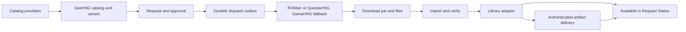

# Software acquisition plan: ROMs and games

**Status:** Implementation in progress

**Researched:** 2026-09-25

**Confidence:** High that ROMarr and Questarr are actively developed as of this date. High that ROMarr needs an extension for durable external request correlation and safe artifact delivery. High that Questarr needs an extension for durable external request/job status and safe artifact delivery. Gamarr remains a conditional fallback pending a defined platform gap.

## Scope

Plan request-driven catalog and acquisition for:

- Retro emulation titles and ROMs.
- Modern emulation systems and their game files.
- Windows, Linux, and macOS games.

The scope includes catalog discovery, request approval, acquisition dispatch, download progress, import or file organization, availability in a library, and user access to a downloaded copy. Playback, launching, emulator setup, and runtime or compatibility-layer configuration are out of scope.

This also adds a universal user-copy requirement to the existing request categories: movies, TV, ebooks, audiobooks, comics, and magazines. The shared Request Status experience must show a small **Download copy** action when the completed artifact is deliverable. For requests with multiple files, let the user choose a file or a supported bundle. A library status alone does not mean the user can download a copy.

General desktop applications for Windows, Linux, and macOS are deferred to a future wishlist item. They are not part of this plan.

## Recommendation

Do not build a new general-purpose game downloader. Create [ROMarrNG](https://github.com/snapetech/ROMarrNG) as the separate Retro and Modern Emulation acquisition service, adapting actively maintained ROMarr for durable SeerrNG request correlation and verified artifact listing/delivery. Maintain [QuestarrNG](https://github.com/snapetech/QuestarrNG) as the separate Games acquisition service and add the request/job and asset contract SeerrNG needs. Keep Gamarr as a forkable fallback for a demonstrated platform gap; its source is active and MIT-licensed, but its request API is not a dependable external contract as-is.

Treat Retro, Modern Emulation, and Games as SeerrNG catalog/request experiences that route to providers by the selected platform and acquisition capabilities. They do not need a different backend just because they have different labels in the UI. Treat acquisition tracking and artifact delivery as separate provider capabilities across every request category.

## Candidate health and integration readiness

This assessment uses release and commit information available on 2026-09-25. Stars and forks are weak adoption signals; tagged releases, documented APIs, persistent job state, and integration tests matter more.

| Backend | Maintenance and maturity evidence | Integration assessment |
| --- | --- | --- |
| [ROMarr](https://github.com/BlizzHacker/romarr) / [ROMarrNG](https://github.com/snapetech/ROMarrNG) | MIT. v0.9.0 was released 2026-09-19, with 79 commits since v0.8.0; the latest commit was on the release date. The v0.9.0 notes describe a persisted queue, failed-download recovery, and a state-file security fix. The repository has an OpenAPI description and tests for the served API. It is still pre-1.0 and had a small public contributor base at review time. | **Fork as ROMarrNG for the first ROM pilot.** Upstream has `POST /api/request`, `GET /api/v1/wanted/missing`, `GET /api/v1/queue`, and history, but request submission does not accept an external idempotency key or return a durable request/job identifier. Its library response does not give SeerrNG a request-scoped, verified file set or byte stream. Add those contracts in the fork; keep all upstream changes isolated behind a SeerrNG adapter. [v0.9.0 notes](https://github.com/BlizzHacker/romarr/releases/tag/v0.9.0) · [activity](https://github.com/BlizzHacker/romarr/commits/main) · [API](https://github.com/BlizzHacker/romarr#api) |
| [Questarr](https://github.com/Doezer/Questarr) / [QuestarrNG](https://github.com/snapetech/QuestarrNG) | GPL-3.0-only. Latest tagged release v1.4.2 was published 2026-08-11. Upstream main was pushed 2026-09-24 and contains package version 1.5.0; QuestarrNG currently tracks upstream main commit `6f31f2999d6b6e029eca557551039526f89615d0`. The project has a versioned integration API, API documentation, and integration tests. | **Maintain QuestarrNG as a separate service and extend the integration API before using it for SeerrNG requests.** Existing v1 accepts title-only requests and does not persist caller request IDs or return request-specific acquisition status/job IDs. The selected platform/OS/architecture must also be recorded and applied before SeerrNG can claim a variant-specific acquisition. The fork remains separate under GPL-3.0-only. [v1.4.2 notes](https://github.com/Doezer/Questarr/releases/tag/v1.4.2) · [recent upstream activity](https://github.com/Doezer/Questarr/commits/main) · [API docs](https://github.com/Doezer/Questarr/blob/main/docs/API.md) · [integration routes](https://github.com/Doezer/Questarr/blob/main/server/routes/integration.ts) · [fork](https://github.com/snapetech/QuestarrNG) |
| [Gamarr](https://github.com/JeremiahM37/gamarr) | MIT. Latest release v1.3.0 was published 2026-08-05; commits continued through 2026-09-25. The project documents an OpenAPI 3.1 API and reports 43 automated end-to-end tests. | **Do not use its request workflow as-is for production. Keep it as the MIT-licensed fork fallback.** The code has request create/list/search/download routes, but those routes are absent from the published OpenAPI document. A request row does not persist the download job ID, and request completion is watched by an in-process goroutine. A fork would need a versioned external contract, idempotency, persisted request-to-job correlation, restart recovery, and dependable status/import reconciliation. [v1.3.0 notes](https://github.com/JeremiahM37/gamarr/releases/tag/v1.3.0) · [recent activity](https://github.com/JeremiahM37/gamarr/commits/main) · [request handlers](https://github.com/JeremiahM37/gamarr/blob/main/internal/api/requests.go) · [OpenAPI document](https://github.com/JeremiahM37/gamarr/blob/main/internal/api/openapi.json) · [request model](https://github.com/JeremiahM37/gamarr/blob/main/internal/models/request.go) |

### What each backend would handle

| SeerrNG area | Preferred route | Fallback and boundary |
| --- | --- | --- |
| Retro Emulation | ROMarrNG for supported platforms. It retains upstream search/indexer/download/import behavior and adds the external SeerrNG request, status, and asset contract. | Keep library services as destinations, not acquisition managers. |
| Modern Emulation | ROMarrNG wherever the exact system and file format are supported. Its documented matrix spans 58 systems, including newer consoles; validate the exact matrix at implementation time. | Use Gamarr only for a demonstrated coverage gap, and then only through the planned fork/adaptation work. Do not route based on an undefined “modern” label. |
| Native PC games | QuestarrNG, after its versioned integration API carries SeerrNG request identity and the target variant and exposes durable job state. It retains Questarr's discovery, Prowlarr/Torznab and Newznab, downloader, and post-processing support. | Gamarr is a fallback if QuestarrNG cannot cover a required platform or source and a GamarrNG fork passes the recovery and API gates. |
| Store-account games | Store-specific connector only when that store is explicitly included in the product matrix. itch.io's butlerd is an official, documented per-store JSON-RPC service with queued tasks, progress, and cancellation. | This does not provide a general game-store API. Steam catalog IDs do not grant download entitlement; Valve's Steamworks API requires a running Steam client and a license for the app. Treat store download as a separate, account-authorized provider. [butlerd](https://itch.io/docs/butler/launcher-integration.html) · [Steamworks API overview](https://partner.steamgames.com/doc/sdk/api) |

## Required provider adaptation

### ROMarrNG: extend through a pinned adapter

ROMarr documents request submission, release search, queue, history, health, and webhook endpoints. Its v0.9.0 queue is persisted across restarts, addressing an earlier loss of request-to-download association. However, `POST /api/request` accepts only a title and platform, and returned queue/history rows do not carry a caller-supplied request ID. The library API also does not identify an exact imported file set for that external request. A local title match is not a safe substitute for those contracts.

Create ROMarrNG from the active upstream and add a stable external request ID with idempotent dispatch, durable request-to-queue/job correlation, exact imported asset listing, and authenticated server-side asset streaming. The SeerrNG adapter must verify import state and request ownership before showing or serving any file. The spike must confirm duplicate submission handling, authentication, cancellation, failed-download retry, import results, request/asset correlation, and state recovery after both systems restart. Do not use its `latest` container tag as a production pin. [ROMarr API and v0.9.0 release](https://github.com/BlizzHacker/romarr/releases/tag/v0.9.0)

### QuestarrNG: add a durable, versioned machine contract

Questarr's API v1 integration endpoints are deliberately limited to ping, library read/sync, and `POST /api/integration/games/request`. The request is title-based and hands off to Questarr's own auto-search pipeline. Its API key is intended for machine integrations, and the API version is explicitly tracked.

For SeerrNG's full request experience, extend that contract with:

- A caller-supplied SeerrNG request ID and deduplication on repeat dispatch.
- Stable catalog identifiers and the selected platform/OS/architecture variant.
- A returned backend request ID and acquisition job ID.
- A read endpoint or callback with searching, downloading, importing, failed, cancelled, and available states plus progress where supported.
- Cancel/retry operations tied to the same request.
- A clear signal that import/library registration is complete, rather than only that a request was accepted.

The fork was created from active upstream main at `6f31f2999d6b6e029eca557551039526f89615d0` (package version 1.5.0; latest tagged release v1.4.2). Keep the QuestarrNG application separate from SeerrNG and comply with its GPL-3.0-only terms. Do not copy its code into SeerrNG. The fork README and API docs must identify the upstream, explain the SeerrNG request/job and asset-delivery contract, and link to the main SeerrNG repository. [Questarr integration API](https://github.com/Doezer/Questarr/blob/main/docs/API.md#integration-api-external-clients) · [upstream release history](https://github.com/Doezer/Questarr/releases) · [QuestarrNG](https://github.com/snapetech/QuestarrNG)

### Gamarr: fork only if it fills a proven platform gap

Gamarr has useful PC and console coverage and existing request, search, download, retry, and library code. Before using it as a SeerrNG provider, a fork must:

1. Add request endpoints and schemas to its OpenAPI document, with a versioned external API contract.
2. Persist an external request ID and the associated download job ID; make enqueue idempotent.
3. Reconcile active requests and download jobs after restart instead of relying on the original in-process watcher.
4. Expose status/progress and cancel/retry operations to external callers.
5. Distinguish download completion from successful import/library availability.
6. Keep API authentication enabled and cover the external contract with integration tests.

Its MIT license makes a separate fork technically straightforward, but ongoing fork maintenance remains an operational cost. Prefer Questarr unless Gamarr is needed for a specific platform or capability Questarr cannot supply.

## Fork naming and documentation policy

If an upstream project will not accept a required change and SeerrNG decides to maintain a fork, use the upstream application name with `NG` appended (for example, `QuestarrNG`, `GamarrNG`, or `ROMarrNG`). Keep the fork as a separate project and preserve the upstream license and attribution requirements.

The fork's README and user/developer documentation must identify the upstream project, state the specific SeerrNG capability the fork exists to provide, describe the maintained changes, and link both to the upstream project and to the main [SeerrNG repository](https://github.com/snapetech/seerrng). Keep those documents current with the fork's behavior and release changes. Apply this naming and documentation rule to every fork created for this plan; do not fork or rename a backend merely as a precaution.

## SeerrNG architecture

Keep SeerrNG as the only user-facing catalog, request, and approval flow. Users should not need to submit the same request to ROMarr, Questarr, or Gamarr.

Add a separate software request domain rather than extending media entities. The current media model requires TMDb identity and carries media-specific fields such as seasons, 4K, and book format. Reuse the existing request policies and reliability patterns: approval and quota checks, the durable `RequestDispatchOutbox`, request history, and lifecycle presentation. Relevant code includes `server/entity/Media.ts`, `server/entity/MediaRequest.ts`, `server/lib/requestStatus.ts`, `server/entity/RequestDispatchOutbox.ts`, and `server/lib/MediaRequestSubscriber.ts`.

Separate these responsibilities:

1. **Catalog provider** — discovers title metadata and preserves provider IDs without making one catalog's identifier mandatory.
2. **Variant resolver** — captures exact platform/system, OS, architecture, version/build, edition, region/language, and file/package format as applicable. The approved variant must not change if catalog metadata later changes.
3. **Acquisition provider** — offers configuration health, idempotent enqueue, job readback, cancellation/retry when supported, and a webhook or polling contract.
4. **Library adapter** — confirms import and availability in the selected folder/library destination.
5. **Artifact delivery adapter** — lists deliverable files and streams a selected asset through SeerrNG after checking request ownership. It may proxy an authenticated provider download API or read from an explicitly configured shared library root. It never returns provider credentials, private file paths, or long-lived provider URLs to the browser.

Record external provider request/job IDs and source/verification metadata. Mark a SeerrNG request available only after the result is imported or registered. Show **Download copy** only after the provider confirms a deliverable artifact. Keep external credentials and temporary download URLs on the server side. Route by the provider's declared platform, variant, and delivery capabilities, not by the display category alone.

## Universal Download copy experience

Use the existing Request Status surface as the common place to read progress and get the result for every request category. Show the lifecycle there as it moves through searching, downloading, importing, and available. When the verified artifact becomes available, use the existing available-request notification path to tell the requester and link back to that request in Request Status. The request row then shows **Download copy** as a compact secondary action in the same position for movies, TV, books, comics, magazines, ROMs, and games.

The browser requests a SeerrNG-authenticated download route scoped to the request and selected asset. For one asset, **Download copy** starts the normal browser file download. For several assets, it opens a compact accessible file picker; **Download all** appears only when the provider can safely construct a complete bundle. SeerrNG verifies that the caller can view the request, resolves the asset through its provider adapter, and streams the bytes or supported archive with a safe `Content-Disposition` filename. Provider URLs, API keys, and server filesystem paths stay on the server. Use streaming/backpressure for large assets; do not load whole game or video files into application memory. Once the browser accepts the stream, its own download UI reports transfer progress; SeerrNG reports the request as available and does not claim it can verify the user's local copy after transfer.

Provider adapters declare whether they can deliver one file, list several files, or package a multi-file result. The UI lists individual episodes, issues, or discs when the provider can identify them; a bundle action is offered only where the provider can construct it safely. A backend that only confirms a library import must be paired with a validated shared-library file adapter before SeerrNG presents the item as downloadable.

### Provider delivery readiness audit

This is based on the current SeerrNG clients and the linked upstream API/controller source reviewed on 2026-09-25. “Available” in a manager means the manager sees an imported file; it does not prove SeerrNG can read that file or send it to a user.

| Request type / backend | What identifies the imported artifact | Existing provider byte-download API | Delivery requirement |
| --- | --- | --- | --- |
| Movie — Radarr | `movieFile.path` and size from the movie resource. [Radarr resource](https://github.com/Radarr/Radarr/blob/develop/src/Radarr.Api.V3/MovieFiles/MovieFileResource.cs) | No movie-file stream action in the [movie-file controller](https://github.com/Radarr/Radarr/blob/develop/src/Radarr.Api.V3/MovieFiles/MovieFileController.cs). | Stream the verified file through SeerrNG from the movie directory after the configured path mapping resolves it. |
| TV — Sonarr | Episode file records expose a path and are linked to episodes. | No user-copy route is part of the episode-file API; its file records are manager metadata. | List the imported files for the requested seasons, then stream a selected file through SeerrNG. |
| Ebook / audiobook — BookshelfNG or Readarr | `GET /api/v1/bookfile?bookId=…` returns `Path` and size. [BookshelfNG-compatible controller](https://github.com/snapetech/bookshelfng/blob/main/src/Readarr.Api.V1/BookFiles/BookFileController.cs) | No file-content action in the book-file controller. | Resolve each returned path through the configured SeerrNG path mapping; keep ebook and audiobook format separation from the request. |
| Comic — Mylar3 | Downloaded issue IDs from `getComic`. | Mylar documents `downloadIssue&id=…` as a browser download. [API reference](https://github.com/mylar3/mylar3/blob/master/API_REFERENCE) | SeerrNG can proxy the authenticated issue stream server-side, after confirming the issue belongs to the requested comic. |
| Comic — Kapowarr | Issue records include file IDs, path, and size; `/api/files/{id}` returns file metadata. [Issue and file handlers](https://github.com/Casvt/Kapowarr/blob/main/frontend/api.py) | The file handler returns metadata and does not stream the comic bytes. | Resolve file IDs only from the requested volume, then stream from a validated mapped library path. |
| Magazine — LazyLibrarian | `getIssues` returns an `IssueFile` path when the issue is imported; SeerrNG currently parses that field. | No file-content action is used by the current integration. | Resolve the path through the configured SeerrNG path mapping and stream the verified issue file. |
| Retro / modern ROM — ROMarrNG | The upstream import event and library integrations do not give SeerrNG a request-scoped file set. [Upstream API](https://github.com/BlizzHacker/romarr/blob/main/romarr/openapi.py) | No supported API route to list exact imported request assets or stream ROM bytes. | ROMarrNG adds a request-correlated asset list and authenticated stream. Preserve multi-file/disc relationships; never guess files by title. |
| PC game — QuestarrNG | Questarr exposes imported game files from a game’s managed library path. [API contract](https://github.com/snapetech/QuestarrNG/blob/main/docs/API.md) | Its current external integration API does not provide a request-scoped file stream. | Extend QuestarrNG v2 with authenticated asset listing and streaming tied to the durable SeerrNG request/job record. |

For filesystem-backed providers, SeerrNG must have read-only access to the library path and a server-side mapping from the manager's reported path to the SeerrNG container path. This is an operator setup requirement; the browser only receives an opaque asset ID, display name, and size. Use canonical paths, reject symlink escapes, and re-check the file at stream time. Providers with their own authenticated download API are proxied by SeerrNG instead. A missing mount, path mapping, file, or provider stream must hide the action and leave an operator-visible delivery error; it must never be reported as a successful user download.

Provider support is explicit; do not infer deliverability from a completed request state.

## Phased plan

### 0. Lock the supported matrix

- Define which systems are Retro and which are Modern; use an explicit system list.
- Decide whether each system's scope includes game files only or also firmware, updates, and DLC.
- Specify whether game variants target Windows, Linux, macOS, console system, architecture, edition, and/or region.
- Decide whether store-account downloads are included initially or remain an optional later Games provider.
- Select the first shared library destination and define what confirms availability.

### 1. Build ROMarrNG as the first provider

Create ROMarrNG from the current stable upstream baseline, retaining license attribution and documenting the purpose and upstream links in README and API docs. Implement the external request/job/asset contract, then pin a disposable SeerrNG integration spike. Test one Retro system and one system from the agreed Modern matrix. Keep the SeerrNG request UI and approval policy authoritative.

**Exit gate:** repeated dispatch cannot create duplicate provider work; the local request remains correlated to its provider job across restarts; SeerrNG can show search/download/import outcomes; and “available” follows library confirmation.

The ROMarrNG spike also checks how an imported ROM or multi-disc set can be delivered to the requesting user. The fork must expose an unambiguous imported file set for the request and an authenticated asset API correlated to the durable request/job contract. Update the fork README and API docs according to the fork policy above.

### 2. Extend QuestarrNG for Games — in progress

QuestarrNG is created from actively maintained upstream main. Add an idempotent external request contract with durable correlation to Questarr's game and download records, selected target metadata, request status readback, and supported cancel/retry operations. Keep the fork's README and API documentation current with the NG branding and SeerrNG purpose.

**Exit gate:** SeerrNG can request a specific game variant, reconcile the provider job after restart, and report truthful progress and availability without adopting Questarr's UI or request database as SeerrNG's source of truth.

### 3. Evaluate Gamarr only for uncovered systems

Compare the supported console/platform matrix with ROMarr and QuestarrNG. If Gamarr uniquely covers a required system or source, create a time-boxed GamarrNG fork implementing the six API/recovery requirements above. If no external project can supply that category reliably, build only the missing acquisition worker/provider for that target.

**Exit gate:** adopt the fork only if it has a documented/versioned API, authenticated and idempotent requests, durable restart recovery, and successful import reconciliation.

### 4. Implement and expand the SeerrNG domain

After the first backend passes, implement one vertical slice using a dedicated software request/job model and the provider boundary above. Add further systems and providers through the same contract. Pin backend versions and schedule routine compatibility/security reviews; do not follow floating `latest` tags.

Add the shared Request Status action and artifact-delivery route across current media request types in the same provider-capability model. The request timeline and artifact availability remain separate so a file can be downloadable without changing the existing approval/quota behavior.

### Current implementation record

- Work is on the `feature/software-acquisition` branch, based on the current SeerrNG `origin/main`.
- The plan update has been carried onto that branch before implementation.
- SeerrNG now has a shared Request Status asset listing and authenticated streaming route for imported movie, TV, ebook/audiobook, comic, and magazine files. Filesystem-backed providers use administrator path mappings; Mylar3 uses its authenticated issue-download stream, with credentials and paths kept server-side.
- Available notifications link to the specific Request Status row. A single file uses the compact **Download copy** action, while multi-file requests show an accessible file picker; no bundle is offered unless a provider can construct one safely.
- The download-copy setup is documented for operators, and its request-scoped endpoints and `requestId` status filter are described in `seerr-api.yml`.
- `snapetech/QuestarrNG` has been created as a separate fork of `Doezer/Questarr` for durable SeerrNG request/job correlation and variant-aware acquisition metadata.
- ROMarrNG is required because upstream lacks stable external request correlation and a request-scoped asset API; the fork will preserve the upstream MIT license and attribution.
- General desktop applications remain a future wishlist item.

## Acceptance criteria

- A request preserves its exact title and selected system/OS/architecture variant.
- Dispatch is idempotent, durable, and recoverable across SeerrNG and provider restarts.
- The user can distinguish searching, downloading, importing/verifying, available, failed, and cancelled.
- The SeerrNG request maps to a provider request/job and resulting library entry.
- Cancellation/retry reflects the actual provider capability.
- A request becomes available only after file import/library confirmation.
- For movies, TV, ebooks, audiobooks, comics, magazines, ROMs, and games, the requester is notified when the request reaches verified availability and sees the same **Download copy** action on its Request Status row.
- Multi-file requests expose the available files and only offer a bundle when the provider can safely construct it.
- Download routes enforce request ownership and stream via SeerrNG without exposing provider credentials, private paths, or long-lived provider URLs.
- Backend credentials and download URLs are not exposed to the browser.
- No UI or backend work launches or plays games or configures emulation/compatibility runtimes.

## Future wishlist: general applications

General-purpose app catalog and acquisition for Windows, Linux, and macOS remains deferred. Revisit platform package managers and store adapters only when that wishlist item is brought back into scope.

## Open decisions

1. What exact systems are included in Modern Emulation?
2. Are native games requested by title only, or must the requester choose OS and architecture before approval?
3. Is a Steam/itch.io account-backed acquisition provider required in the first Games release?
4. Should acquired files land in one shared library or a user-specific destination?

## Sources reviewed

- [ROMarr project](https://github.com/BlizzHacker/romarr), [v0.9.0 release](https://github.com/BlizzHacker/romarr/releases/tag/v0.9.0), [API description/tests](https://github.com/BlizzHacker/romarr/blob/main/romarr/openapi.py)
- [Questarr project](https://github.com/Doezer/Questarr), [v1.4.2 release](https://github.com/Doezer/Questarr/releases/tag/v1.4.2), [activity](https://github.com/Doezer/Questarr/commits/main), [API docs](https://github.com/Doezer/Questarr/blob/main/docs/API.md), [integration tests](https://github.com/Doezer/Questarr/blob/main/server/__tests__/integration_api.test.ts)
- [Gamarr project](https://github.com/JeremiahM37/gamarr), [v1.3.0 release](https://github.com/JeremiahM37/gamarr/releases/tag/v1.3.0), [activity](https://github.com/JeremiahM37/gamarr/commits/main), [request handlers](https://github.com/JeremiahM37/gamarr/blob/main/internal/api/requests.go), [OpenAPI document](https://github.com/JeremiahM37/gamarr/blob/main/internal/api/openapi.json), [request model](https://github.com/JeremiahM37/gamarr/blob/main/internal/models/request.go)
- [itch.io butlerd integration](https://itch.io/docs/butler/launcher-integration.html) and [Steamworks API overview](https://partner.steamgames.com/doc/sdk/api)
